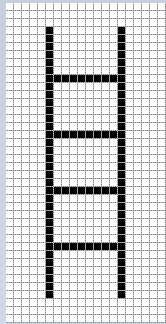
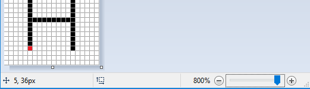

Drawing from reference
----------------------

Току-що научихме как да рисуваме някои основни фигури в средата на PyGame, използвайки функции за рисуване. Както беше споменато преди, всички такива изображения се състоят от пиксели. Това са така наречените растерни или растерни изображения. Видяхме, че за да нарисуваме основни фигури, трябва да знаем координатите на пикселите, които определят всяка такава форма. В по-реалистична ситуация обаче тези координати не се дават директно и ние трябва да ги определяме сами.

Ако искаме програмно да генерираме изображение, използвайки съществуваща растерна карта като ориентир, можем да определим координатите на точките от даденото изображение. Можем да увеличим изображението в една от програмите за преглед на изображения, за да накараме всеки пиксел да изглежда като квадрат. Това може да изглежда така:

Можем да видим, че това изображение е генерирано чрез изчертаване на 4 хоризонтални и 2 вертикални линии, а също така, че всичките 6 линии са черни и 1 пиксела широки. Тъй като знаем, че *x* координатата се брои отляво надясно и *y* отгоре надолу, както и че броенето започва от нула, можем да определим координатите на началната и крайната точка на всички шест реда просто като преброим.

Стълбица
'''''''''

Прочетете координатите от увеличеното изображение по-горе и напишете програма, която очертава стълби като тези.

**Съвет:** Чрез преброяване (от нула) можем да открием, че координатите на крайните точки на лявата вертикална линия са (5, 3) и (5, 36). Координатите на крайните точки на останалите 5 линии трябва да се определят по същия начин.

.. activecode:: PyGame__drawing_ladder_assist
   :nocodelens:
   :enablecopy:
   :modaloutput:
   :includexsrc: src\PyGame\1_Drawing\3_ByGrid\ladder_small.py

   canvas.fill(pg.Color("white")) # paint background

   pg.draw.line(canvas, pg.Color("black"), ( 5, 3), ( 5, 36), 1)  # left side
   pg.draw.line(canvas, pg.Color("black"), (???, ???), (???, ???), 1)  # right side

   pg.draw.line(canvas, pg.Color("black"), (???, ???), (???, ???), 1) # step
   pg.draw.line(canvas, pg.Color("black"), (???, ???), (???, ???), 1) # step
   pg.draw.line(canvas, pg.Color("black"), (???, ???), (???, ???), 1) # step
   pg.draw.line(canvas, pg.Color("black"), (???, ???), (???, ???), 1) # step
   
Реалният размер на изображението е много малък, само 20 пиксела широк и 40 пиксела висок. Бихме могли да определим и координатите на точките за по-големи изображения, като броим, но това би било досадно и податливо на грешки (затова в този пример избрахме толкова малко изображение). Добрата новина е, че програмите за преглед и редактиране на изображения обикновено показват координатите на пиксела, върху който в момента е курсорът на мишката. Координатите на курсора обикновено се пишат някъде в лентата на състоянието в долната част на прозореца, в който се изпълнява програмата, често в долния ляв ъгъл.

Например, в програмата за рисуване *Paint*, когато изображението е увеличено 8 пъти и се показва решетката, която подчертава отделните пиксели, лесно можем да позиционираме курсора върху всеки пиксел и да четем координатите му. На тази снимка курсорът на мишката беше върху червения пиксел, който, както казахме по-рано, има координатите (5, 36).

~~~~

В следващите задачи трябва да напишете програма, която изчертава чертеж възможно най-близко до дадената. Можете да видите чертежите, които трябва да нарисувате, когато кликнете върху бутона „Задача за игра“.

За да ви помогне да определите координатите на важни точки в чертеж, програмата, която стартирате, като щракнете върху бутона „Задача за игра“, освен чертежа, ще покаже координатите на точката, където е курсорът на мишката. За да се улесни четенето, във всички примери координатите на всички значими точки са закръглени до 5 пиксела (координатите завършват с нула или пет).

Ако искате да решите тези задачи извън уеб браузъра, в своята програма за програмиране можете да изтеглите изображенията, които вашите програми трябва да нарисуват, да ги отворите в преглед на изображения и да прочетете координатите на важните точки там.

.. image:: ../../_images/PyGame/drawing_grid_antenna.png
   :width: 120px
.. image:: ../../_images/PyGame/drawing_grid_balance.png
   :width: 120px                
.. image:: ../../_images/PyGame/drawing_grid_house.png
   :width: 120px                
.. image:: ../../_images/PyGame/drawing_grid_smiley.png
   :width: 120px                
.. image:: ../../_images/PyGame/drawing_grid_trees.png
   :width: 120px                

Антена
''''''

Преди кабелна телевизия телевизионни сигнали бяха получени от антени, които обикновено бяха поставени на покривите на домовете и сградите на хората. В тази задача трябва да се изготви една такава антена.

Както можете да видите, когато стартирате примера, чертежът се състои от седем реда. Ширината на вертикалната линия е 4 пиксела, горните две хоризонтални 1, средните два 2, а долните два 3 пиксела. Цветът на фона е "skyblue".

.. activecode:: PyGame__drawing_antenna_simple_assist
    :nocodelens:
    :enablecopy:
    :modaloutput:
    :playtask:
    :includexsrc: src\PyGame\1_Drawing\3_ByGrid\antenna_assist.py
   
    pg.draw.line(canvas, color???, (150, y1???,), (150, y2???,), 4)
    pg.draw.line(canvas, ???
    pg.draw.line(canvas, ???
    pg.draw.line(canvas, ???
    pg.draw.line(canvas, ???
    pg.draw.line(canvas, ???
    pg.draw.line(canvas, ???

.. reveal:: PyGame__drawing_antenna_simple_reveal
   :showtitle: Покажи отговора
   :hidetitle: Скрий отговора

   Пълната програма е предоставена, можете да опитате и тук.
	       
   .. activecode:: PyGame__drawing_antenna_simple_solution
      :nocodelens:
      :enablecopy:
      :modaloutput:
      :includesrc: src\PyGame\1_Drawing\3_ByGrid\antenna.py
                   

Balance scale
'''''''''''''

Тази рисунка се състои от линия (чиято ширина е 2) и три триъгълника. Средният триъгълник, който представлява опората на баланса, се запълва с цвят, така че при начертаването му параметърът на ширината трябва да се пропусне, докато за останалите два триъгълника трябва да се посочи ширина 2.

.. activecode:: PyGame__drawing_balance
   :nocodelens:
   :enablecopy:
   :modaloutput:
   :playtask:
   :includexsrc: src\PyGame\1_Drawing\3_ByGrid\balance_assist.py
   
   canvas.fill(color???)) # paint background green
   pg.draw.line(canvas, color???, (x1???, y1???), (x2???,  y2???), 2) # beam
   
   # support
   pg.draw.polygon(canvas, pg.Color("brown"), [(???, ???), ...
   
   # left pan
   pg.draw.polygon(canvas, pg.Color("brown"), [(???, ???), ...
   
   # right pan
   pg.draw.polygon(canvas, pg.Color("brown"), [(???, ???), ...

.. commented out 

    .. reveal:: PyGame__drawing_balance_reveal
       :showtitle: Show solution
       :hidetitle: Hide solution

       Пълната програма е предоставена, можете да опитате и тук.
               
       .. activecode:: PyGame__drawing_balance_solution
          :nocodelens:
          :enablecopy:
          :modaloutput:
          :includesrc: src\PyGame\1_Drawing\3_ByGrid\balance.py

Усмивчо
''''''''

В тази задача работата, която трябва да се свърши, е малко по-сложна. Тъй като чертежът е съставен от кръгове и елипси, ние не можем точно да прочетем всички координати и измервания, които са ни необходими директно. Това, което можем да направим, е да прочетем за всяка елипса координатата: math: `x` на най-лявата и най-дясната му точка ((:math:`X_L` и :math:`X_R`), както и :math:`y `координата на най-високата и най-ниската точка (:math:`Y_T` и :math:`Y_B`). След това ширината и височината на елипсата могат да бъдат изчислени като разликите на съответното :math:`x` ( за ширина) и :math:`y` координати (за височина).

Що се отнася до кръга, имаме различни опции:

- можем да нарисуваме кръга като елипса, вписана в квадрат (с помощта на функцията *pg.draw.ellipse*)
- можем да приблизим координатите на центъра на кръга
- ако искаме да определим координатите на центъра на кръга по-точно, първо можем да намерим точките :math:`X_L`, :math:`X_R`, :math:`Y_T` и :math:`Y_B` като направихме за елипси и след това изчислихме координатите на центъра, използвайки формули :math:`X_c = {{X_R + X_L}\over2}` и :math:`Y_c={{Y_T + Y_B}\over2}`

.. activecode:: PyGame__drawing_smiley
   :nocodelens:
   :enablecopy:
   :modaloutput:
   :playtask:
   :includexsrc: src\PyGame\1_Drawing\3_ByGrid\smiley_assist.py
   
   canvas.fill(color???) # paint background white
   pg.draw.circle(canvas, color???, (x???, y???), r???)           # head
   pg.draw.ellipse(canvas, color???, (x???, y???, w???, h???))    # left eye
   pg.draw.ellipse(canvas, ???, (???, ???, ???, ???))             # right eye
   pg.draw.ellipse(canvas, ???, (???, ???, ???, ???))             # mouth interior
   pg.draw.ellipse(canvas, ???, (???, ???, ???, ???), thickness?) # mouth edge
   
.. commented out

    .. reveal:: PyGame__drawing_smiley_reveal
       :showtitle: Show solution
       :hidetitle: Hide solution

       Пълната програма е предоставена, можете да опитате и тук.
               
       .. activecode:: PyGame__drawing_smiley_solution
          :nocodelens:
          :enablecopy:
          :modaloutput:
          :includesrc: src\PyGame\1_Drawing\3_ByGrid\smiley.py

Kъща
'''''

Чертежът на къща се състои от кафяв правоъгълник и червен триъгълник. Можем да нарисуваме триъгълника като многоъгълник с три върха. Слънцето е изобразено като оранжев кръг, а тревата като зелен правоъгълник. Имайте предвид реда на рисуване за тревата и слънцето.

Достатъчно е да прочетете приблизително координатите на центъра на окръжността, представяща Слънцето. За тези, които искат малко математическо предизвикателство, имайте предвид, че координатите на центъра могат да бъдат по-точно определени като предишната задача, въпреки че най-ниската точка не се вижда и координатата :math:`Y_B` не може да бъде прочетена.

Ако искате да видите как можете да определите координатите на центъра с по-точно четене и изчисляване, кликнете върху бутона "Определяне на центъра".

.. reveal:: PyGame__drawing_house_circle_center_reveal
   :showtitle: Determining the center
   :hidetitle: Hide determining the center

    Както в предишната задача, нека :math:`X_L` и :math:`X_R` обозначават :math:`x` координатите на най-лявата и дясната точка на окръжността, която представлява Слънцето, и :math:`Y_T` , :math:`Y_B` и :math:`y` координати на най-високата и най-ниската точка на този кръг.
    
    Можем да определим :math: `x` координатата на центъра, както направихме в предишния пример, :math:`X_C = {{X_R + X_L} \over 2}`.
    
    Тъй като най-ниската точка на кръга не се вижда, не можем да прочетем стойността :math:`Y_B`, но можем да определим радиуса :math:`r`, използвайки :math:`r = X_C - X_L` или :math:`r = X_R - X_C`. Сега :math:`y` координатата на центъра се получава лесно: :math:`Y_C = Y_T + r`, така че дори не ни трябваше :math:`Y_B`.
    
.. activecode:: PyGame__drawing_house
   :nocodelens:
   :enablecopy:
   :modaloutput:
   :playtask:
   :includexsrc: src\PyGame\1_Drawing\3_ByGrid\house2D_assist.py
   
   canvas.fill(color???) # paint background light gray
   ???
   ???
   pg.draw.rect(canvas, color???, (x???, y???, w???, h???)) # house
   pg.draw.polygon(canvas, color???, [(x1???, y1???), (x2???, y2???), (x3???, y3???)]) # roof

.. commented out

    .. reveal:: PyGame__drawing_house_reveal
       :showtitle: Show solution
       :hidetitle: Hide solution

       Пълната програма е предоставена, можете да опитате и тук.
               
       .. activecode:: PyGame__drawing_house_solution
          :nocodelens:
          :enablecopy:
          :modaloutput:
          :includesrc: src\PyGame\1_Drawing\3_ByGrid\house2D.py
   
Дървета
''''''''

Трябва да бъдат начертани три еднакви дървета, така че всяко следващо дърво да се получи, като се премести предишното надясно. Очевидно тази задача би могла да бъде дадена чрез просто описание на първото дърво и посочване на разстоянието между две съседни дървета. Програмата, която рисува изображението, се дава все пак, защото използването на изображение за задаване на задача е по-ясно и по-просто.

За да направите задачата малко по-скоро като реална ситуация (в която няма изображение), в този пример четенето на :math:`x` координатата е умишлено деактивирана за дясната страна на изображението. Всички необходими координати, които не можете да четете, могат да бъдат изчислени.

.. activecode:: PyGame__drawing_trees
   :nocodelens:
   :enablecopy:
   :modaloutput:
   :playtask:
   :includexsrc: src\PyGame\1_Drawing\3_ByGrid\trees_assist.py
   
.. commented out

    .. reveal:: PyGame__drawing_trees_reveal
       :showtitle: Прикажи решење
       :hidetitle: Сакриј решење

       Пълната програма е предоставена, можете да опитате и тук.
               
       .. activecode:: PyGame__drawing_trees_solution
          :nocodelens:
          :enablecopy:
          :modaloutput:
          :includesrc: src\PyGame\1_Drawing\3_ByGrid\trees.py
