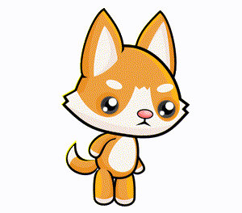

Анимация
=========

Известно е, че видеоклиповете се състоят от голям брой изображения, които се показват достатъчно бързо едно след друго, като последователните изображения се различават само леко. Създаването на видеоклипове по този начин е по същество възможно, тъй като човек (човек) с достатъчно висока скорост на изобразяване на изображения не е в състояние да вижда отделни изображения, а по-скоро те се смесват и създават впечатление за движение.

Създаването на впечатление за движение с неподвижни изображения се нарича анимация. Например от следните осем снимки на персонаж на различни позиции:

.. image:: ../../_images/PyGame/pganim_running1.png
   :width: 120px
.. image:: ../../_images/PyGame/pganim_running2.png
   :width: 120px
.. image:: ../../_images/PyGame/pganim_running3.png
   :width: 120px
.. image:: ../../_images/PyGame/pganim_running4.png
   :width: 120px
.. image:: ../../_images/PyGame/pganim_running5.png
   :width: 120px
.. image:: ../../_images/PyGame/pganim_running6.png
   :width: 120px
.. image:: ../../_images/PyGame/pganim_running7.png
   :width: 120px
.. image:: ../../_images/PyGame/pganim_running8.png
   :width: 120px

е създадена следната анимация:
           

           
Всяко от изображенията, които се появяват в анимация, се нарича *кадър*. Програмите, по които работихме досега, рисуваха само една рисунка (рамка) и изображението не беше променено след това. В програми, които използват анимация, за всеки кадър трябва да се нарисува по едно изображение. В следващите уроци ще видим как можем да направим това.

   .. toctree::
      :maxdepth: 1

      ./03_PyGame_21_Animation_Basics.rst
      ./03_PyGame_22_Animation_Motion.rst
      ./03_PyGame_23_Animation_Stages.rst
      ./03_PyGame_24_Animation_Text.rst
      ./03_PyGame_25_Animation_Multiple.rst
