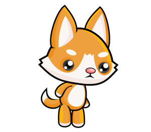
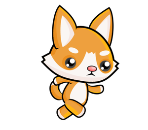

Как се прави анимация
---------------------

Един прост начин да получите анимация е да поставите частта от програма, която рисува един кадър в отделна функция. Като правило, ние ще наричаме тази функция *new_frame* в програмите, въпреки че тя може да има друго име.

Промяна на чертежите
'''''''''''''''''''''

За да получите анимация, функцията, която рисува кадър, трябва да създаде чертеж, малко по-различен от предишния при следващото повикване, тъй като без промени няма анимация. За да бъде новата рисунка различна, самата рисунка трябва да зависи от стойностите на някои променливи. Промяната на стойностите на променливите, от които зависи чертежът, ще доведе до различен чертеж.

Например, ето как можем да създадем програма, която последователно показва по-малко и по-голямо сърце.

.. image:: ../../_images/heart_smaller.png
   :width: 120px

.. image:: ../../_images/heart_bigger.png
   :width: 120px

.. activecode:: PyGame__anim_heart_blinking
   :nocodelens:
   :enablecopy:
   :modaloutput:
   :includesrc: src/PyGame/2_Animation/2a_Anim_Basics/heart_blinking.py

Функцията използва променливата *image_index*, която получава само стойности 0 или 1. Тази променлива се използва като индекс (пореден номер) на изображение в списъка с изображения, който се състои от две изображения. Въз основа на променливата *image_index*, програмата решава кое от двете изображения ще бъде показано. С всяко ново изпълнение на функцията *new_frame* променливата *image_index* променя стойността (ако е била 0, получава стойност 1 и обратно), като по този начин променя изображението, което трябва да се покаже.

Казват, че променливите, от които зависи рисунката, описват сцената. Може да има една или повече такива променливи. В примера със сърцето сцената се описва от една променлива, която е променливата *image_index*.

В общия случай, когато създаваме нова анимационна рамка, използваме старите стойности на променливите, описващи сцената, за да изчислим техните нови стойности. По този начин новите стойности могат или не могат да се различават от старите. Ние наричаме това изчисление актуализация на сцената.

Глобални променливи
''''''''''''''''''''

За да можете да актуализирате сцена във функцията *new_frame*, променливите, описващи сцената, трябва да имат стойности преди и след изпълнение на функцията *new_frame*. Затова трябва да формираме тези променливи (да им присвоим първите стойности) в основната част на програмата. Когато използваме такива променливи във функция, ги наричаме глобални променливи. За разлика от тях променливите, направени в самата функция, се наричат ​​локални променливи и съществуват само по време на изпълнение на функцията.

Когато присвояваме стойности на глобална променлива във функция, трябва да посочим в началото на функцията, че това са променливи, които вече съществуват и се формират извън тази функция. За променливата *image_index* в горния пример, ние постигнахме това, като напишехме ``global image_index`` в първия ред на функцията. Ако не декларирахме променливата глобална, Python ще се опита да формира нова локална променлива със същото име, когато присвои стойност на променливата.

Когато има няколко глобални променливи, които възнамеряваме да променим във функция, след думата *global* трябва да изброим имената на всички такива променливи, разделени със запетаи.

Скорост на анимацията
''''''''''''''''''''''

Скоростта на анимация се определя от продължителността на всеки кадър, т.е. броя на кадрите, показани в единица време. За да посочим скоростта, с която се появяват последователни кадри, използваме съкращението (също мерна единица) fps - кадрите в секунда. Когато създаваме анимация, едно от нещата, които трябва да направим, е да изберем скоростта на изобразяване и да я зададем в нашата програма като броя на кадрите, които искаме програмата да създава и показва в секунда.

В предишната програма използвахме 2 кадъра в секунда, за да получим ритъм, подобен на сърдечната честота. По този начин ясно разграничихме два кадъра, които се появяват последователно. За да създадем впечатление за движение, ни трябват само по-високи скорости и повече изображения.

.. infonote::

    Обикновено най-малко 15 кадъра в секунда се използват за анимация на движението, тъй като при по-бавни скорости на изобразяване движението може да изглежда прекъсващо. Например телевизионните предавания обикновено използват 24 кадъра в секунда, а в наши дни видеоигрите под 30 кадъра в секунда не се считат, че осигуряват достатъчно добро изживяване. Дори по-бързите анимации могат да осигурят още по-добри ефекти за някои зрители, но те също са по-скъпи за създаване и изобразяване. 
    
    Ако зададем много висока скорост в програмите си, може да не е възможно нашият компютър да постигне такава скорост на генериране на изображения, нито такава скорост на показване. В този случай няма да възникнат грешки, но действителната (ефективна) честота на кадрите ще бъде по-малка (тази, която компютърът може да постигне). 

Анимацията на бягането от уводния текст може да се постигне с програма, много подобна на сърцето пример. Единствената фундаментална разлика е, че използва по-голям брой изображения (осем вместо две) и по-висока честота на кадрите.

.. image:: ../../_images/running1.png
   :width: 50px
.. image:: ../../_images/running2.png
   :width: 50px
.. image:: ../../_images/running3.png
   :width: 50px
.. image:: ../../_images/running4.png
   :width: 50px

.. image:: ../../_images/running6.png
   :width: 50px

.. image:: ../../_images/running8.png
   :width: 50px

.. activecode:: PyGame__anim_running
   :nocodelens:
   :enablecopy:
   :modaloutput:
   :includesrc: src/PyGame/2_Animation/2a_Anim_Basics/running.py

Опитайте различни честоти на кадрите и вижте как този параметър влияе на външния вид на анимацията. Разбира се, освен броя на кадрите в секунда, цялостното преживяване се влияе и от това колко много последователни изображения се различават (повече изображения с по-малки разлики дават по-добър ефект, но това изисква по-висока честота на кадрите).

~~~~

Нека обобщим какво трябва да направите, за да създадете анимация:

- дефиниране на глобални променливи, които описват сцената (тези данни ще се променят по време на анимацията);
- дефинирайте функция ``new_frame``, която актуализира данните за героите и обектите в сцената и след това начертава сцената (не забравяйте да изброите глобалните променливи, които се променят във функцията след думата ``global``);
- в края на програмата извикайте функцията ``pygamebg.frame_loop (fps, new_frame)``, където *fps* е желаната честота на кадрите. Функцията *frame_loop*, в допълнение към всичко, което *wait_loop* направи, също така извиква функцията *new_frame* искан брой пъти в секунда. Ето защо в анимациите ще завършваме програми с *frame_loop* вместо *wait_loop*.

Анимации - въпроси
'''''''''''''''''''

.. dragndrop:: pygame__anim_quiz_frametime1
    :feedback: Опитай пак!
    :match_1: 10 fps ||| 100 milliseconds
    :match_2: 20 fps ||| 50 milliseconds
    :match_3: 50 fps ||| 20 milliseconds
    :match_4: 100 fps ||| 10 milliseconds

    Свържете продължителността на кадъра с броя на кадрите в секунда.

.. questionnote::

    **Задача - предложение:** Ако желаете, опитайте да създадете програма Python, която циклично ще показва избраните от вас снимки или други изображения по ваш избор (ако всичките ви снимки са с еднакъв размер, вече сте научили всичко необходимо). Имайте предвид, че честотата на кадрите може да е по-малка от 1 fps и може да не е цяло число (но трябва да бъде положителна). Например в програмата *слайдшоу*, която предлагаме, има естествена необходимост всяко изображение да продължи по-дълго от една секунда.

.. fillintheblank:: pygame__anim_quiz_frametime2

    За да се покаже всеки кадър за две секунди, колко кадъра в секунда трябва да се зададат в програмата?

    - :0[,\.]5: Вярно!
      :[0-9]+[,\.]?[0-9]*: опитай пак.
      :.*: резултатът трябва да бъде число.

.. mchoice:: pygame__anim_quiz_toggle
   :answer_a: image_index = image_index + 1 % num_images
   :answer_b: image_index = (image_index % num_images) + 1
   :answer_c: image_index = (image_index + 1) % num_images
   :answer_d: image_index = image_index % (num_images + 1)
   :correct: c
   :feedback_a: Опитай пак
   :feedback_b: Опитай пак
   :feedback_c: Вярно
   :feedback_d: Опитай пак

    В примера се изискваше променливата *image_index* циклично да приема само онези стойности, които съответстват на позициите на изображенията в списъка. Когато имаме осем изображения, тези стойности са 0, 1, 2, 3, 4, 5, 6, 7, 0, 1, 2 и т.н. В общия случай за *n* изображенията тези стойности са 0, 1, 2, ... n-1, 0, 1, 2 и т.н.

    Спомнете си, че операторът % обозначава операцията за изчисляване на остатъка след разделянето. С тази операция можем да постигнем същата цел в по-кратки нотации. Коя от следните команди може еднакво да замени тази част от програмата?
   
    .. code::
   
        image_index = image_index + 1 # move on to the next picture
        if image_index == num_images:    # if there is no next picture ...
            image_index = 0            # return to the first picture

