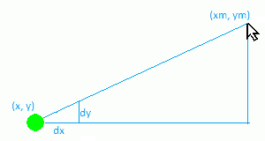

Разчитане на позицията на мишката
----------------------------------

В PyGame има лесен начин да прочетете текущото състояние на мишката. Данните, които обикновено ни интересуват, са положението на мишката и натискането на бутони. В този урок ще използваме четене на позицията на мишката, а в следващия бутони на мишката. Освен позицията и натискането на бутона, има друга информация за мишката, която можем да получим, но тук няма да правим това. Заинтересованите могат да намерят повече подробности, например `тук <https://www.pygame.org/docs/ref/mouse.html>`__.

Можем да получим позицията на мишката, като извикаме функцията ``pg.mouse.get_pos()``, която връща подредена двойка координати на точката, в която в момента се намира курсорът на мишката.

Както ще видим в следващите примери и задачи, използването на тази функция е много проста и можем по-нататък да използваме позицията за четене на мишката по различни начини.

Примери и задачи
''''''''''''''''''

.. questionnote::

    **Пример - пеперуда следва мишката:**
    
    В този пример зареждаме две изображения на пеперуди и ги показваме последователно, както направихме в анимациите. Новото е, че където показваме пеперудата, се определя от положението на мишката, което сме получили от функцията *pg.mouse.get_pos()*.

.. image:: ../../_images/butterfly1.png
   :width: 50px
.. image:: ../../_images/butterfly2.png
   :width: 50px

.. activecode:: PyGame__interact_butterfly1
    :nocodelens:
    :modaloutput:
    :includesrc: src/PyGame/3_Interaction/3a_Mouse_readpos/butterfly1.py

Вероятно сте забелязали, че когато движите мишката по-бързо, пеперудата изостава малко. Това се случва, защото само 5 кадъра се показват в секунда, така че забавянето може да бъде до 0,2 секунди.

Това забавяне лесно се елиминира чрез увеличаване на честотата на кадрите (показване на повече кадри в секунда), но след това изображенията се превключват твърде често и пеперудата размахва крилата си твърде бързо. Решението е да увеличите честотата на кадрите, като същевременно показвате всяко изображение по време на множество кадри.

.. questionnote::

    **Задача - движете се бързо, клатете бавно:**
    
    Копирайте предишната програма тук, след което я модифицирайте, така че пеперудата да не изостава от мишката, докато скоростта на махане остава същата.

**Съвет:** за да може пеперудата да не изостава, със сигурност имаме нужда от повече кадри в секунда, например *n* пъти повече. Това означава, че функцията *new_frame* се нарича *n* пъти по-често от преди. За да се поддържа една и съща скорост на махане, всяко изображение трябва да се показва *n* пъти по-дълго, тоест по време на *n* последователни кадри.

.. activecode:: PyGame__interact_butterfly2
    :nocodelens:
    :modaloutput:
    :playtask:
    :includehsrc: src/PyGame/3_Interaction/3a_Mouse_readpos/butterfly2.py

.. questionnote::

    **Задача - към мишката:** Напишете програма, в която зелена топка се движи към мишката, като в примера (бутон „Play Task“).
    
**Съвет:** В тази задача ключовият момент е как се променят координатите :math:`(x, y)` на центъра на топката. В ситуация като тази на снимката, ние искаме да увеличим *x* с *dx* и *y* с *dy*. В зависимост от това как искаме топката да се движи, стойностите *dx*, *dy* могат да бъдат изчислени по различни начини. Един лесен начин е да изберете :math:`dx = {1 \ над 10} (xm - x), dy = {1 \ над 10} (ym - y)`.

.. activecode:: PyGame__interact_towards_mouse
    :nocodelens:
    :modaloutput:
    :playtask:
    :includehsrc: src/PyGame/3_Interaction/3a_Mouse_readpos/towards_mouse.py

.. questionnote::

    **Задача - към мишката със следа:** Копирайте предишната програма и след това я модифицирайте така, че топката да остави сива следа, като в примера (бутон „Play Task“).
    
**Съвет:** Движението на топката е същото като в предишния пример. За да направим следа, трябва да съхраним списък с няколко (използвахме 20) предишни позиции на топката.

Когато изчисляваме ново състояние, добавяме най-новата позиция към списъка и ако списъкът е станал твърде дълъг, изтриваме най-старата позиция.

Когато рисуваме следа, за всеки кръг използваме цвят *(нюанс, нюанс, нюанс)*, където нюансът се равнява на 255 (бяла) преди контура, а в контура намалява с определена стойност, така че в последния преминава през цикълът става нула (черен) или възможно най-близо до нулата.

Така например, ако списъкът се нарича *trace*, тези или подобни изявления трябва да се появят във вашата програма:

.. code::

    trace = []
    ...
    
    def new_frame():
        
        ...
        trace.append((x, y))
        ...
        if ...
            trace = trace[1:]

.. activecode:: PyGame__interact_towards_mouse_with_trace
    :nocodelens:
    :modaloutput:
    :playtask:
    :includehsrc: src/PyGame/3_Interaction/3a_Mouse_readpos/towards_mouse_with_trace.py

~~~~

Накрая можете да изпробвате следните две програми и да си поиграете с тях.

За да се правят програми като тези, в допълнение към програмните техники, показани тук, човек има нужда от известни познания по физика (еластична сила, вторият закон на Нютон) и математиката (теорема на Питагор). Разгледайте програмите, без да е необходимо да ги разбирате напълно. Ако желаете, опитайте малко да промените някои константи, така че да видите как това се отразява на поведението на програмата.

.. questionnote::

    **Пример: Йо-Йо**
    
.. activecode:: PyGame__interact_yoyo
    :nocodelens:
    :modaloutput:
    :includesrc: src/PyGame/3_Interaction/3a_Mouse_readpos/yoyo.py

.. questionnote::

    **Пример: Очи** 

Тази програма също изисква малко повече познания по математика, така че няма да навлизаме в подробности. Ако се интересувате от това как работи тази програма и сте добър в математиката, опитайте се да разберете подробностите с малко помощ.

.. activecode:: PyGame__interact_eyes
    :nocodelens:
    :modaloutput:
    :includesrc: src/PyGame/3_Interaction/3a_Mouse_readpos/eyes.py
