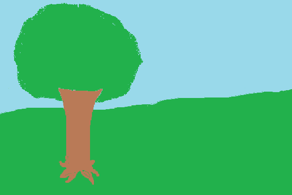

Събития с мишка
----------------

В примера "превключвател" показахме как можем да реагираме в програма, когато потребителят натисне бутон на мишката. Въпреки че за потребителя едно щракване изглежда като еднократно действие, видяхме, че за компютъра това е последователност от събития, която започва със събитие от типа *pg.MOUSEBUTTONDOWN*.

В следващите примери и задачи ще използваме три типа събития, генерирани от мишката:

- Натискане на който и да е бутон на мишката (като в примера с превключвателя), в този случай *event.type* има стойност *pg.MOUSEBUTTONDOWN*
- Освобождаване на бутон на мишката, в този случай *еvent.type* има стойност *pg.MOUSEBUTTONUP*
- Преместване на мишката, в този случай *event.type* има стойност *pg.MOUSEMOTION*. Всъщност при движение на мишката се генерират множество такива събития (всяко от тях описва малко движение на мишката в много кратък интервал от време, така че всяко събитие от този вид обикновено описва движение само на няколко пиксела).

Обектите на събитието, чийто тип е *pg.MOUSEBUTTONDOWN*, също съдържат допълнителна информация, като например:

- *event.pos* - положението на мишката по време на регистриране на събитието (вече използвано в примера на превключвателя)
- *event.button* - число от 1 до 5, указващо кой бутон на мишката е натиснат (1 - вляво, 2 - в средата, 3 - вдясно, 4 - превъртете нагоре, 5 - превъртете надолу)

Някои от допълнителните данни за събитията, съдържащи се в *pg.MOUSEMOTION* обекти са:

- event.pos - позицията на мишката след събитието за движение на мишката
- event.rel - подредена двойка, която описва колко се е променила позицията на мишката след предишното събитие за движение на мишката
- event.buttons - списък с три елемента на логически стойности, които определят за всеки от трите бутона на мишката (0 - вляво, 1 - средна, 2 - дясна) дали е натиснат по време на движение на мишката.

Обработка на щракване - упражнения
''''''''''''''''''''''''''''''''''''

Може да не сте забелязали, че в програмата "превключване" от предишния урок, светлината може да бъде включена и изключена, като щракнете върху който и да е бутон на мишката. Това е така, защото за всеки бутон на мишката се генерира един и същ тип събитие и не проверихме кой бутон е натиснат, когато събитието се е случило.

.. questionnote::

    **Задача - ляв бутон като превключвател:** 
    
    Копирайте програмата "превключвател" тук, след което я променете, така че светлината да може да се включва и изключва само с левия бутон на мишката.

**Съвет:** Използвайте данните *event.button*.

.. activecode:: PyGame__interact_switch_left_button
    :nocodelens:
    :enablecopy:
    :playtask:
    :modaloutput:
    :includehsrc: src/PyGame/3_Interaction/3d_Mouse_events/Switch_left_button.py

.. questionnote::

    **Задача - три превключвателя:** 
    
    Използвайте части от програмата "превключвател" и създайте програма, която симулира работата на три превключвателя, както е показано в примера.

.. image:: ../../_images/Shema3_Off.png
   :width: 50px
.. image:: ../../_images/Shema3_On.png
   :width: 50px
.. image:: ../../_images/SwitchOff.png
   :width: 50px
.. image:: ../../_images/SwitchOn.png
   :width: 50px
.. image:: ../../_images/BulbOff.png
   :width: 50px
.. image:: ../../_images/BulbOn.png
   :width: 50px

.. activecode:: PyGame__interact_switches
    :nocodelens:
    :enablecopy:
    :playtask:
    :modaloutput:
    :includehsrc: src/PyGame/3_Interaction/3d_Mouse_events/Switches.py

    import pygame as pg, pygamebg
    (width, height) = (800, 500)
    canvas = pygamebg.open_window(width, height, "Switches")

    schema_images = (pg.image.load('Shema3_Off.png'), pg.image.load('Shema3_On.png'))
    switch_images = (pg.image.load('SwitchOff.png'), pg.image.load('SwitchOn.png'))
    bulb_images = (pg.image.load('BulbOff.png'), pg.image.load('BulbOn.png'))

    switch_on = [False, False, False]
    switch_pos = [(100, 200), (300, 150), (300, 250)]
    bulb_pos = (500, 100)
    
    # finish the program

Други събития с мишка
''''''''''''''''''''''

Както бе споменато в началото на този урок, една програма може също така да реагира на събития за освобождаване на бутона на мишката и движение на мишката. За целта е необходимо да се сравни стойността на *event.type* с константите *pg.MOUSEBUTTONUP* и *pg.MOUSEMOTION*. Следват задачи, в които можете да изпробвате това.

.. questionnote::

    **Задача - рисуване на линии:** 
    
    Попълнете програмата, така че да може да очертава прави линии, както в примера.

.. activecode:: PyGame__interact_mouse_lines1
    :nocodelens:
    :enablecopy:
    :playtask:
    :modaloutput:
    :includehsrc: src/PyGame/3_Interaction/3d_Mouse_events/mouse_lines1.py

    import pygame as pg, pygamebg
    (width, height) = (400, 400)
    canvas = pygamebg.open_window(400, 400, "Lines with mouse")

    mosue_pos = (0, 0)
    line_start = mosue_pos
    line_is_being_drawn = False
    previous_lines = []

    def new_frame():
        canvas.fill(pg.Color("white")) # paint canvas
        if line_is_being_drawn:
            pg.draw.line(canvas, pg.Color('black'), line_start, mosue_pos)

        for a, b in previous_lines:
            pg.draw.line(canvas, pg.Color('black'), a, b)

    def handle_event(event):
        global line_is_being_drawn, line_start, mosue_pos

        
        # add statements here that work as follows:
        
        # if the event type is "mouse button down":
        #     the line drawing mode is switched on
        #     we start the line at the current position of the mouse
        # otherwise, if the event type is "mouse button going up":
        #     the line drawing mode is switched off
        #     the new line is from the memorized start of the line to the current position of the mouse
        #     add a new line to the list of previous lines
        # otherwise, if the event type is "moving mouse":
        #     in the mouse_pos variable, remember the current position of the mouse

    pygamebg.frame_loop(30, new_frame, handle_event)

.. questionnote::

    **Задача - рисуване на линии с изтриване:**

    Копирайте програмата за рисуване на линии по-долу, след което добавете възможност за изтриване на всички линии с десен бутон.

**Съвет:** За да разграничите левия и десния бутон на мишката в програмата, данните *event.button* трябва да се използват отново. Кодът във функцията *handle_event* сега трябва да изглежда така:

.. activecode:: PyGame__interact_mouse_lines2_part
    :passivecode: true

        if the event type is "mouse button going down":
            if button 1 (left button) is pressed
                the line drawing mode is switched on
                the new line is from the memorized start of the line to the current position of the mouse
            if button 3 (right button) is pressed
                empty the list of previous lines
        otherwise, if the event type is "releasing mouse button":
            if button 1 (left button) is pressed
                the line drawing mode is switched off
                the new line is from the memorized start of the line to the current position of the mouse
                add a new line to the list of previous lines
        otherwise, if the event type is "move mouse":
            remember the current position of the mouse in the mouse_pos variable 

.. activecode:: PyGame__interact_mouse_lines2
    :nocodelens:
    :enablecopy:
    :playtask:
    :modaloutput:
    :includehsrc: src/PyGame/3_Interaction/3d_Mouse_events/mouse_lines2.py

.. questionnote::

    **Задача - влачене:** 
    
    Следващата програма показва как да се позволи на потребителя на програмата да влачи обекти.
    
    Изпробвайте програмата (плъзнете ябълките в кошницата) и се опитайте да я разберете, след което отговорете на въпросите по-долу.

.. image:: ../../_images/basket.png
   :width: 50px

.. activecode:: PyGame__interact_drag
    :nocodelens:
    :enablecopy:
    :modaloutput:
    :includesrc: src/PyGame/3_Interaction/3d_Mouse_events/drag.py

.. mchoice:: pygame__interact_quiz_drag1
   :answer_a: индексът на ябълката, която рисуваме
   :answer_b: индексът на ябълката, която влачим
   :answer_c: общ брой ябълки
   :answer_d: броя на ябълките, останали на дървото
   :correct: b
   :feedback_a: Опитай пак
   :feedback_b: Вярно
   :feedback_c: Опитай пак
   :feedback_d: Опитай пак

   Каква е променливата *i_apple* в програмата? 

.. dragndrop:: pygame__interact_quiz_drag2
    :feedback: Опитай пак!
    :match_1: if mouse_is_on_image(event.pos, basket_pos, basket_image):|||whether the apple should be deleted
    :match_2: if mouse_is_on_image(event.pos, apple_positions[i]|||whether the user "took" the apple
    :match_3: if len(apple_positions) == 0:|||whether the game is over
    :match_4: if i_apple >= 0:|||whether a drag is ongoing

    Съберете проверките на програмата с техните значения.

.. mchoice:: pygame__interact_quiz_drag3
   :answer_a: четем, че бутонът на мишката е надолу по време на движение 
   :answer_b: влаченето е отделен тип събитие
   :answer_c: когато обикновеното движение на мишката индексът на "ябълката, която влачим" е -1
   :correct: c
   :feedback_a: Това не е удобен начин, тъй като бутонът може да бъде натиснат на празно място (потребителят не е "взел" обекта, който трябва да се влачи) 
   :feedback_b: Не, няма такъв тип събития
   :feedback_c: Вярно

   Как различаваме между влаченето от обикновено движение на мишката в дадена програма?
